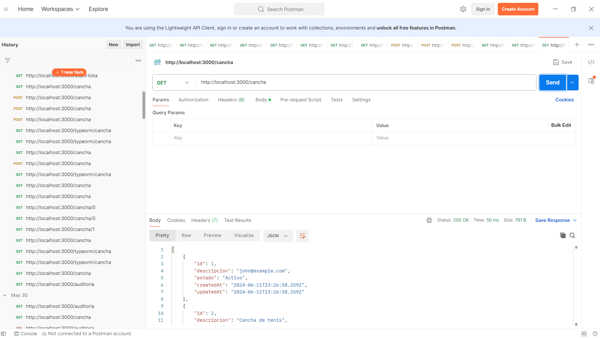
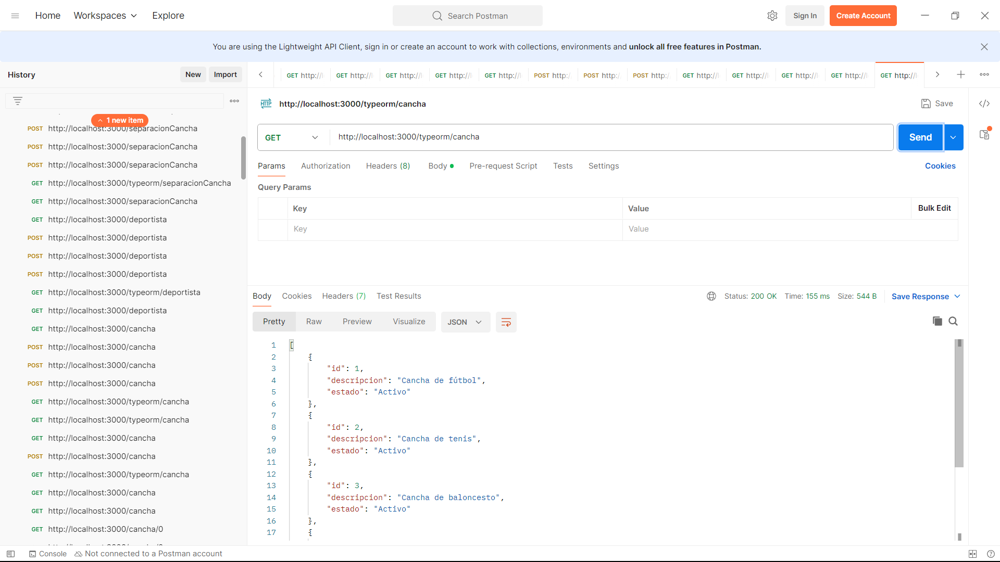
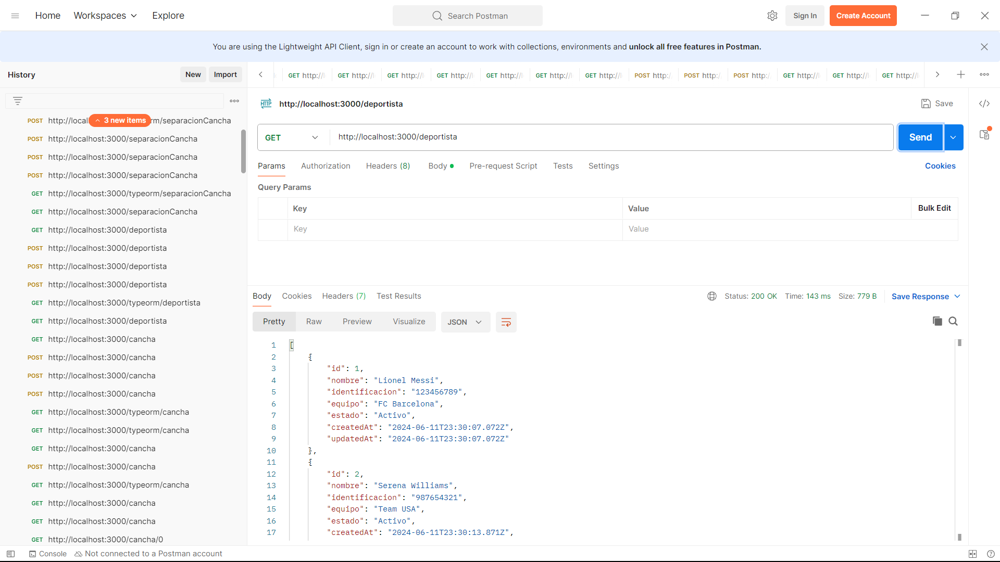
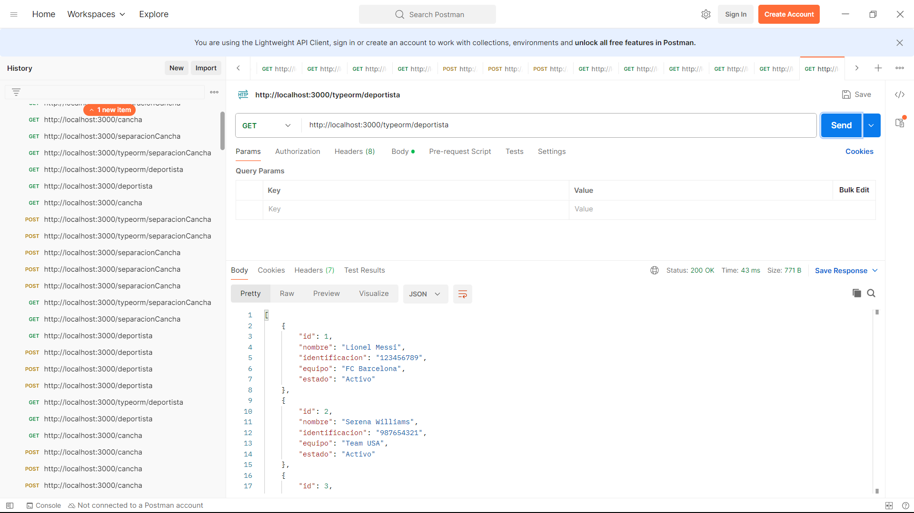
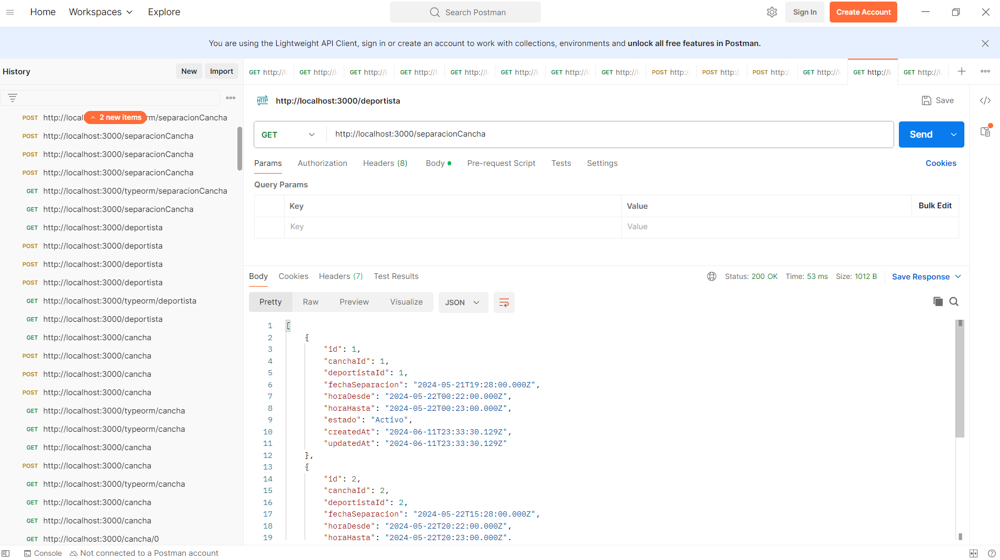
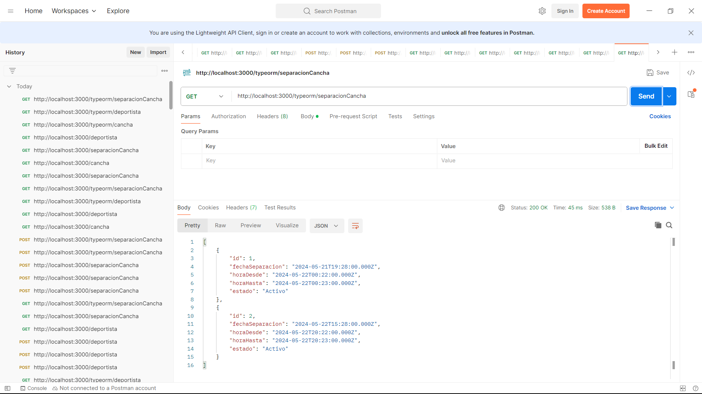

# Documentación de la API Platform

Este documento proporciona una descripción general de la API Platform y documenta las pruebas realizadas para verificar su funcionamiento.

## Descripción de la API

La API Platform proporciona endpoints RESTful para gestionar entidades relacionadas con el mundo del deporte, como canchas, deportistas y separaciones de canchas para eventos deportivos.

## Endpoints Disponibles
- `/cancha`: Endpoints para gestionar canchas.
- `/deportista`: Endpoints para gestionar deportistas.
- `/separacioncancha`: Endpoints para gestionar la separación de canchas para eventos deportivos.
- `/typeorm/cancha`: Endpoints para gestionar canchas.
- `/typeorm/deportista`: Endpoints para gestionar deportistas.
- `/typeorm/separacioncancha`: Endpoints para gestionar la separación de canchas para eventos deportivos.

## Pruebas Realizadas

### Obtener Todas las Canchas

**Request:**
Obtener Todas las Canchas
Request:
GET http://localhost:3000/cancha
**Response:**

GET http://localhost:3000/typeorm/cancha
**Response:**

**Request:**
Obtener Todos los deportistas
Request:
GET http://localhost:3000/deportista
**Response:**

GET http://localhost:3000/deportista
**Response:**

**Request:**
Obtener Todas las sepacionesCancha
Request:
GET http://localhost:3000/separacioncancha
**Response:**

GET http://localhost:3000/typeorm/separacioncancha
**Response:**

